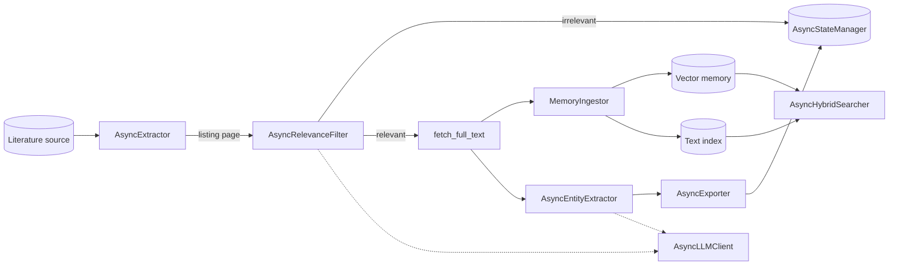

# sci-etl-core

[](https://github.com/xueromll/sci-etl-core/actions/workflows/ci.yml)
[](https://xueromll.github.io/sci-etl-core/)
[](https://pypi.org/project/sci-etl-core/)

`sci-etl-core` is a Python library for turning scientific papers from any field
into structured, searchable data. It fetches papers from arXiv, PubMed,
OpenAlex, and Semantic Scholar, reads their full text, extracts the values you
ask for with an LLM, and keeps the papers searchable on your own machine.

[udg-catalogue](https://github.com/xueromll/udg-catalogue) shows the result. It
screens astrophysics papers on arXiv, extracts measurements of ultra-diffuse
galaxies, and publishes a cross-matched catalog of 1,285 objects, with keyword
and semantic search over the papers behind it. `sci-etl-core` supplies the
fetching, parsing, extraction, caching, resumable state, and search, while
udg-catalogue adds the astronomy: prompts, validation rules, sky-position
matching, and the dashboard.

Nothing in the library is tied to astronomy. Field knowledge lives in your
prompts, validators, and normalizers, so the same building blocks work for any
field of science.

**Documentation: https://xueromll.github.io/sci-etl-core/**

## Motivation

I built `sci-etl-core` while working with scientific papers during my
undergraduate physics studies, after rewriting the same fetch–parse–extract–cache
machinery one too many times. It's a personal research and learning project,
released free and open-source under the MIT License — not a commercial product.

## Features

- **Composable building blocks** — extractors, parsers, LLM clients, embedding
  memory, processors, exporters, and state managers behind abstract base
  classes, with `Sync*Adapter` wrappers for existing blocking implementations.
  Run the whole pipeline, or use only the parts you need, such as search.
- **Async-first orchestration** through `AsyncETLPipeline`, with bounded
  concurrency, resumable crash-safe state, graceful shutdown, polite retries
  that honor `Retry-After`, shared and per-host rate limits, progress events
  and run metrics, and explicit failure signaling through `PipelineAborted`.
  `ETLPipeline` runs the same pipeline from blocking code.
- **LLM response caching** in memory or SQLite, so a rerun doesn't pay for the
  same prompt twice.
- **Semantic memory and local search** — embed full texts into a vector store,
  query a SQLite FTS5 index with Boolean syntax, fuse BM25 with embedding
  similarity, filter by metadata facets, and grow graphs of related papers.
- **Concrete implementations included** — arXiv, PubMed, Semantic Scholar,
  and OpenAlex extractors; OpenAI-compatible chat and embedding clients; PDF,
  LaTeX, HTML, DOCX, and JATS XML parsers; CSV, SQL, and Plotly exporters;
  dataframe processors and record validators.
- **Typed configuration** from YAML and `.env`, an offline test suite at 100%
  coverage, and PEP 561 type information.
  
## Installation

Python 3.11 or newer is required.

```bash
pip install "sci-etl-core[async,llm,pdf]"   # everything the example below uses
pip install "sci-etl-core[full]"            # every bundled component except local embeddings
```

With Poetry or uv:

```bash
poetry add "sci-etl-core[async,llm,pdf]"
uv add "sci-etl-core[async,llm,pdf]"
```

The base install covers configuration, both pipelines, state, the sync
adapters, HTML, LaTeX, DOCX, and JATS XML parsing, Boolean search, and the
pandas processors. Components load their optional dependencies only when you
import them, so add an extra for each component group you use:

| Extra | Needed for |
|-------|------------|
| `async` | The bundled extractors, `build_async_client`, CSV export, `load_config_async` |
| `llm` | `AsyncOpenAICompatibleClient`, token-based truncation |
| `pdf` | `PdfPlumberParser` |
| `sql` | `SqlTableSink`, and the deprecated `AsyncSqlTableExporter` |
| `viz` | `Plotly3DSink`, and the deprecated `AsyncPlotly3DExporter` |
| `cluster` | `ClusteringStep` |
| `embeddings` | `AsyncOpenAIEmbedder`, the vector stores, `AsyncEmbeddingRelevanceFilter` |
| `embeddings-local` | `AsyncSentenceTransformerEmbedder` |

The
[installation guide](https://xueromll.github.io/sci-etl-core/latest/getting-started/installation/)
lists the packages each extra adds.

Prefer configuration to code? [sci-etl-cli](https://github.com/xueromll/sci-etl-cli)
runs these pipelines from a single YAML file.

## Example

```python
import asyncio
import os

from sci_etl_core import (
    AsyncArxivExtractor,
    AsyncCsvUpsertExporter,
    AsyncETLPipeline,
    AsyncFileStateManager,
    AsyncLLMEntityExtractor,
    AsyncLLMRelevanceFilter,
    AsyncOpenAICompatibleClient,
)
from sci_etl_core.http_async import build_async_client
from sci_etl_core.parsers import LatexTarballParser, PdfPlumberParser
from sci_etl_core.processors import DefaultKeyNormalizer

RELEVANCE_PROMPT = 'Does the paper report measurements of galaxies? Reply with JSON: {"relevant": true} or {"relevant": false}.'
EXTRACTION_PROMPT = 'Extract every measured object. Reply with JSON: {"items": [{"name": "...", "value_a": 0.0}]}.'


async def main() -> None:
    client = build_async_client()
    llm = AsyncOpenAICompatibleClient(api_key=os.environ["LLM_API_KEY"], base_url="https://api.openai.com/v1", model="gpt-4o-mini")
    pipeline = AsyncETLPipeline(
        extractor=AsyncArxivExtractor(client=client, pdf_parser=PdfPlumberParser(), latex_parser=LatexTarballParser()),
        relevance_filter=AsyncLLMRelevanceFilter(llm_client=llm, system_prompt=RELEVANCE_PROMPT),
        entity_extractor=AsyncLLMEntityExtractor(llm_client=llm, system_prompt=EXTRACTION_PROMPT),
        exporter=AsyncCsvUpsertExporter(key_column="name", value_columns=["value_a"], normalizer=DefaultKeyNormalizer()),
        state_manager=AsyncFileStateManager("state/processed.txt", "state/metadata.json"),
        destination="results.csv",
        closeables=[client, llm],
    )
    async with pipeline:
        processed = await pipeline.run(query="all:galaxy", total_limit=50)
    print(f"Processed {processed} relevant records")


asyncio.run(main())
```

The [quick start](https://xueromll.github.io/sci-etl-core/latest/getting-started/quick-start/)
explains what a run does, how it resumes, and what the prompts must ask for.

## Configuration

Settings load from a YAML file into Pydantic models, and the LLM API key comes
from the `LLM_API_KEY` environment variable, which a `.env` file can supply.
Validation errors raise `ConfigurationError`, naming each failing key without
echoing its value.

```yaml
llm:
  base_url: https://api.openai.com/v1
  model: gpt-4o-mini
http:
  user_agent: "my-project/1.0 (mailto:you@example.org)"
pipeline:
  search_query: "all:galaxy"
  total_limit: 50
  max_concurrency: 4
  newest_first: true
```

```python
from pathlib import Path

from sci_etl_core import AsyncOpenAICompatibleClient, BaseAppConfig, load_config


class ProjectConfig(BaseAppConfig):
    output_csv: str = "results.csv"


config = load_config(ProjectConfig, Path("config.yaml"))
llm = AsyncOpenAICompatibleClient.from_config(config.llm)
run_arguments = config.pipeline.run_arguments()
```

Subclass `BaseAppConfig` to add typed sections of your own. `from_config`
builders take the matching section, and `run_arguments()` returns the keyword
arguments for `run()`. The
[configuration guide](https://xueromll.github.io/sci-etl-core/latest/getting-started/configuration/)
lists every key and its default.

## Architecture



`AsyncETLPipeline` receives every collaborator through its constructor and
depends only on the abstract interfaces, so any stage can be replaced by
another implementation or a test double. It pages through the listing by
cursor, processes up to `max_concurrency` records at a time, and marks a record
processed only after its entities are exported, so a failed record is retried
on the next run, until it has failed in `max_attempts` runs. The
[architecture guide](https://xueromll.github.io/sci-etl-core/latest/guide/architecture/)
describes each layer.

## Documentation

| Topic | Where |
|-------|-------|
| Installation, quick start, blocking usage, configuration | [Getting started](https://xueromll.github.io/sci-etl-core/latest/getting-started/installation/) |
| Sources, post-processing, semantic memory, state, shutdown, retries, rate limiting, events, caching | [Guide](https://xueromll.github.io/sci-etl-core/latest/guide/sources/) |
| Boolean and hybrid search, facets, discovery graphs | [Local search and discovery](https://xueromll.github.io/sci-etl-core/latest/guide/search/) |
| Components and how they connect | [Architecture](https://xueromll.github.io/sci-etl-core/latest/guide/architecture/) |
| Every public class and function | [API reference](https://xueromll.github.io/sci-etl-core/latest/reference/) |
| The `sci-etl` command-line tool | [CLI](https://xueromll.github.io/sci-etl-core/latest/cli/) |

## Testing

```bash
pip install -e ".[full,dev,lint]"
pytest --cov=sci_etl_core --cov-report=term-missing
ruff check .
mypy
```

The suite runs offline, and `pytest --cov` fails if line coverage drops below
100%.

## Contributing

Contributions are welcome — new extractors, parsers, exporters, and embedding
backends especially. See [CONTRIBUTING.md](CONTRIBUTING.md) to get set up, and
browse [good first issues](.github/ISSUE_TEMPLATE/good_first_issue.md) if
you're new. Moving an existing pipeline onto the library? See [MIGRATION.md](MIGRATION.md).
What's planned is in [ROADMAP.md](ROADMAP.md), and releases are recorded in
[CHANGELOG.md](CHANGELOG.md). All participation is governed by our
[Code of Conduct](CODE_OF_CONDUCT.md).

## Security

Please report vulnerabilities privately — see [SECURITY.md](SECURITY.md).

## License

This is a non-commercial research and educational project, freely available under the MIT License. See [LICENSE](LICENSE) for details.
